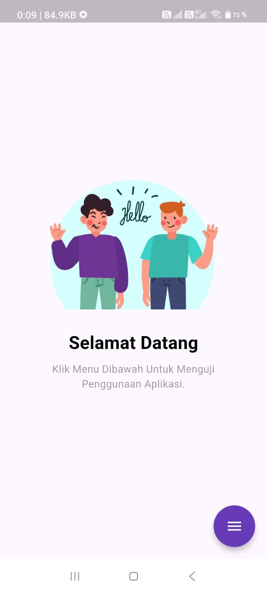
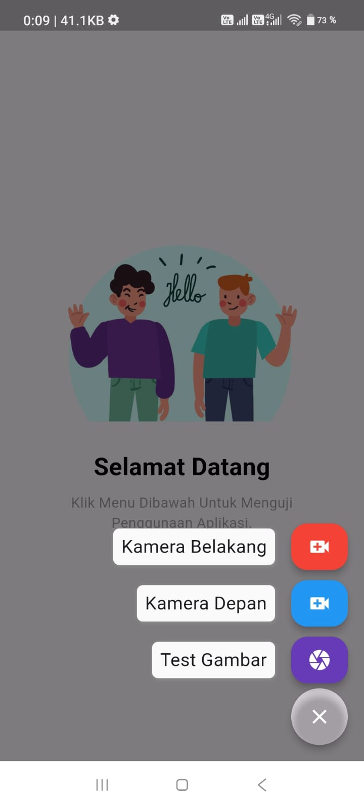
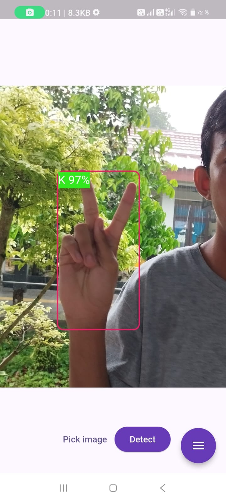
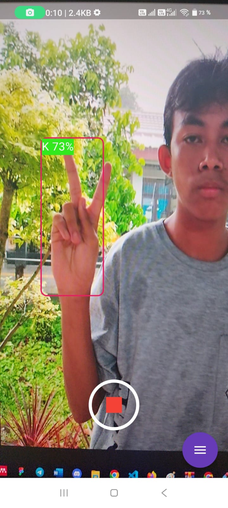
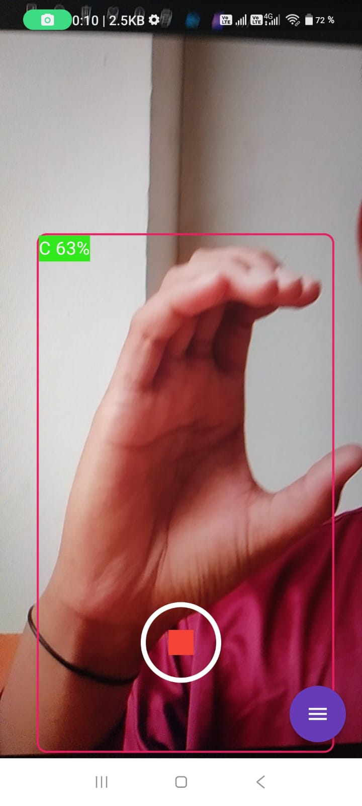

# YOLOV5s American SIGN Language (FLUTTER)

A fully functional Flutter application dedicated to the You Only Look Once (YOLO) algorithm for Real Time Object Detection / Segmentation SIGN LANGUAGE. The [flutter_vision](https://github.com/vladiH/flutter_vision) package has been instrumental in setting this algorithm up as well as the models, references and infrastructure provided by [ultralytics](https://github.com/ultralytics/ultralytics)

## Screenshot

## Insructions

1. Make sure to have the Flutter SDK installed and pointed at by your IDE.
2. Open the repository with your IDE, go to pubspec.yaml and perform `pub get`
3. Select a mobile device to run the application on.
4. Hit Run.
5. ???

# YOLOV5_sign_language_ABC
